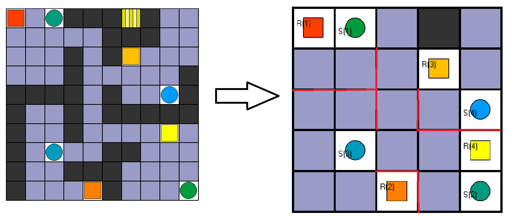

# asprilo with abstraction

To try to increase performance an original instance is abstracted by combining all 2x2 node sets into a single node or cell.
Additionaly a new atom, which states which cells are connected, is derived to guarantee a correct plan. An example of this
abstraction can be seen below, where the red lines represent the constrained connections.
 
Abstraction Example:
 
 
A slightly modified [asprilo solver](https://github.com/potassco/asprilo-encodings) then solves the abstracted instance 
after which the plan is refined onto the original instance. To do so, 3 time steps are guaranteed for each robot at each 
cell, which naturally results in a longer solution.

Usage: `clingo abs.lp <instance.lp> -c horizon=<time horizon>`
The time horizon describes the time limit for the solver on the abstracted instance. The real time horizon will be 3x+2, 
where x is the given time horizon.

The instance should only contain `init1` atoms. A correct instance can be obtained from a regular instance by using the 
provided racket script `/tools/prep_instances.rkt`, which performs a simple search and replace.

Requires the following directory structure:
``` shell
./abs.lp
./ref.lp
./solver/encoding.lp
./solver/input.lp
./solver/action-M.lp
./solver/goal-M.lp
./solver/output-M.lp
```

Known limitations:
- instances with "diagonal" walls should be avoided and replaced with "connected" walls, as they can result in incorrect plans
- no multiple robots/shelves in one cell

## Results

Below are the results of our encoding and the native encoding. The horizon is always the minimal horizon with which a valid solution was found.
For the abstraction the horizon denotes the time limit for the solver on the abstracted instance, while the value in parenthesis denotes the 
translated time limit onto the original instance. All benchmarks were performed on an AMD Ryzen 7 3700X 8-Core Processor with 32GB of RAM.

| Instance | w/ abs horizon (ref) | w/ abs Solving Time (in s) | w/o abs horizon | w/o abs Solving Time (in s) |
|:--------:|:--------------------:|:--------------------------:|:---------------:|:---------------------------:|
| B01 | 3 (11) | 0.034 | 5  | 0.008 |
| B02 | 4 (14) | 0.039 | 7  | 0.011 |
| B03 | 3 (11) | 0.037 | 7  | 0.011 |
| B04 | 2 (8)  | 0.032 | 4  | 0.007 |
| B05 | 6 (20) | 0.060 | 11 | 0.015 |
| B06 | 2 (8)  | 0.034 | 4  | 0.008 |
| B07 | 4 (14) | 0.060 | 9  | 0.022 |
| B08 | 8 (26) | 0.337 | 14 | 0.048 |
| B09 | 2 (8)  | 0.040 | 4  | 0.014 |
| B10 | 5 (17) | 0.212 | 9  | 0.038 |
| B11 | 6 (20) | 0.637 | 12 | 0.092 |

| Instance | w/ abs horizon (ref) | w/ abs Solving Time (in s) | w/o abs horizon | w/o abs Solving Time (in s) |
|:--------:|:--------------------:|:--------------------------:|:---------------:|:---------------------------:|
| R15x15r10 | 5 (17) | 0.807 | 11 | 0.138 |
| R20x20r15 | 7 (23) | 7.368 | 13 | 0.444 |
| R20x20r40 | 3 (11) | 0.772 | 7  | 0.317 |

## Conclusion

Our encoding using abstraction and refinement can solve most instances correctly (see known limitations). Compared to the native asprilo 
encoding our encoding performs slightly worse on smaller benchmarks but significantly worse on bigger ones. This is due
to the fact, that the abstraction and refinement is a quite demanding task, which scales with the size of the instance.
That means the complexity of the abstraction and refinement rises faster than the complexity of the 
path finding problem itself at least on instances with a relatively small number of robots. 
On the bigger benchmark with a lot of robots the performance converges once more.
As we only dipped our toes into the thematic of abstraction and refinement with this project,
we strongly believe our solution can definitely be improved, if more time is invested into it.